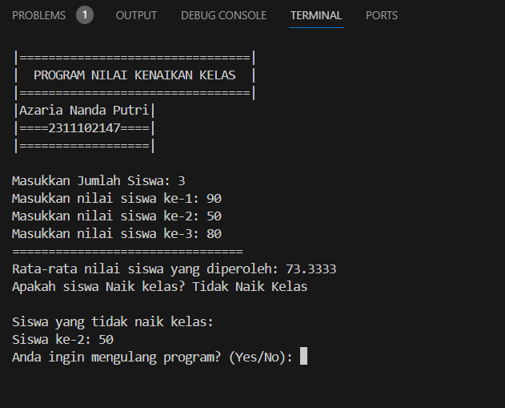
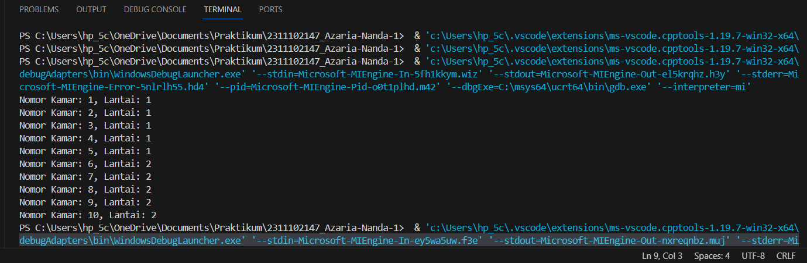

# <h1 align="center">Laporan Praktikum Modul Tipe Data</h1>
<p align="center">Azaria Nanda Putri - 2311102147</p>

## Dasar Teori

Tipe data adalah klasifikasi nilai suatu variabel yang membantu operasi komputer untuk mengenali nilai data tanpa menghasilkan kesalahan keluaran. Tipe data dalam program memudahkan dalam mendeteksi berbagai jenis informasi. Selain itu, tipe data juga memastikan sistem operasional dapat berjalan dengan lancar dan meminimalkan kesalahan (error).

1. Tipe Data Primitif<br/>
Tipe data primitif adalah tipe data dasar yang tersedia secara langsung pada suatu bahasa pemrograman. Sebagai contoh, tipe data integer dan char merupakan beberapa contoh dari tipe data primitive tersebut.

2. Tipe Data Abstract<br/>
Tipe data abstrak merupakan suatu konsep dalam pemrograman yang menyediakan representasi data dan operasi terkait tanpa harus mengungkapkan detail implementasinya. Konsep ini bertujuan untuk meningkatkan tingkat abstraksi dan modularitas dalam pengembangan perangkat lunak. Contoh dari tipe data abstrak meliputi tumpukan (stack), antrian (queue), dan daftar (list).

3. Tipe Data Koleksi<br/>
Tipe data koleksi adalah jenis data dalam pemrograman yang memungkinkan penyimpanan dan pengolahan sekumpulan data, seperti array. Hal ini memungkinkan pengelompokan data untuk pengolahan yang lebih efisien. Contoh data koleksi:
    -Array (struktur data yang menyimpan sekumpulan nilai yang memiliki tipe data yang sama)
    -Vector (sama seperti array. Tetapi bisa berubah ukuran dan memori secara dinamis, cocok untuk himpunan nilai yang fleksibel)
    -Map (Tipe data map memetakan kunci ke nilai, memudahkan penyimpanan dan akses data dengan cepat)
    
## Guided 

### 1. Tipe Data Primitif

```C++
#include <iostream>
#include <iomanip>

using namespace std;


int main(){
    char op;
    float num1, num2;

    cout << "Enter operator (+, -, *, /): ";
    cin >> op;

    cout << "Enter two operands: ";
    cin >> num1 >> num2;

    switch (op)
    {
    case '+':
        cout << "Result: " << num1 + num2 << endl;
        break;
    case '-':
        cout << "Result: " << num1 - num2 << endl;
        break;
    case '*':
        cout << "Result: " << num1 * num2 << endl;
        break;
    case '/':
        if (num2 == 0) {
            cout << "Result: " << fixed << setprecision(2) << num1 / num2 << endl;
        } else {
            cout << "Error!: Division by zero" << endl;
        }
        break;

    default:
        cout << "Error! operator is not correct" << endl;
        break;
    }
    return 0;
}
```
Kode di atas digunakan untuk memilih operasi penambahan (+), pengurangan (-), perkalian (*), dan pembagian (/). Keempat operasi ini akan jalan jika user sudah menginput dua angka pada saat penginputan cin. Terdapat juga dua tipe data primitif pada program ini, yaitu char dan float. Tipe data char digunakan pada saat pemilihan switch case dan float digunakan sebagai tipe data 2 angka yang diinput user.

### 2. Tipe Data Abstrak

```C++
#include <stdio.h>
#include <string.h>

// Struct
struct Mahasiswa
{
    char name[50];
    char address[50];
    int age;
};
int main() {
    // Menggunakan Struct
    struct Mahasiswa mhs1, mhs2;

    // Mengisi nilai ke struct
    strcpy(mhs1.name, "Dian");
    strcpy(mhs1.address, "Mataram");
    mhs1.age = 22;
    strcpy(mhs2.name, "Bambang");
    strcpy(mhs2.address, "Surabaya");
    mhs2.age = 23;

    // Mencetak isi dari struct
    printf("## Mahasiswa 1 ##\n");
    printf("Nama: %s\n", mhs1.name);
    printf("Alamat: %s\n", mhs1.address);
    printf("Umur: %d\n", mhs1.age);
    printf("\n");
    printf("## Mahasiswa 2 ##\n");
    printf("Nama: %s\n", mhs2.name);
    printf("Alamat: %s\n", mhs2.address);
    printf("Umur: %d\n", mhs2.age);

    return 0;
}
```
Kode di atas digunakan untuk mencetak isi dari struct. Struct merupakan salah satu contoh dari tipe data abstrak. Pada kode di atas terdapat sebuah struct Mahasiswa. Pada struct Mahasiswa ini, terdapat 3 nilai, yaitu char name dengan ukuran 50, char address dengan ukuran 50 juga, dan int age. Lalu pada int main, diisi nilai dan dideklarasikan struct Mahasiswa dengan 2 objek, yaitu mhs1 dengan nama Dian dan mhs2 dengan nama Bambang.

### 3. Tipe Data Koleksi

```C++
#include <iostream>
#include <array>

using namespace std;

int main() {
    // Deklarasi dan inisialisasi array
    int nilai[5];
    nilai[0] = 23;
    nilai[1] = 50;
    nilai[2] = 34;
    nilai[3] = 78;
    nilai[4] = 90;

    // Mencetak array dengan tab
    cout << "Isi array pertama : " << nilai[0] << endl;
    cout << "Isi array kedua : " << nilai[1] << endl;
    cout << "Isi array ketiga : " << nilai[2] << endl;
    cout << "Isi array keempat : " << nilai[3] << endl;
    cout << "Isi array kelima : " << nilai[4] << endl;

    return 0;
}
```
Kode di atas digunakan untuk mencetak isi dari sebuah array. Array merupakan salah satu contoh dari tipe data koleksi. Pada kode di atas, terdapat library array yang membantu proses pemrogramannya. Terdapat array nilai yang dapat menampung 5 nilai, yaitu 23, 50, 34, 78, dan 90. Lalu dideklarasikan di bawahnya.

## Unguided 

### 1. Buatlah program menggunakan tipe data primitif minimal dua fungsi dan bebas. Menampilkan program, jelaskan program tersebut dan ambil kesimpulan dari materi tipe data primitif!

```C++
#include <iostream>

using namespace std;

// Deklarasi struct untuk data siswa
struct Siswa {
    float nilai;
};

// Fungsi untuk menghitung rata-rata nilai
float hitungRataRata(Siswa siswa[], int jumlahSiswa) {
    float total = 0;
    for (int i = 0; i < jumlahSiswa; i++) {
        total += siswa[i].nilai;
    }
    return total / jumlahSiswa;
}

// Fungsi untuk menentukan status kenaikan kelas
string kenaikanKelas(float rataRata) {
    if (rataRata >= 75) {
        return "Selamat, siswa Naik kelas!";
    } else {
        return "Tidak Naik Kelas";
    }
}

// Fungsi untuk input nilai siswa
void inputNilai(Siswa siswa[], int jumlahSiswa) {
    for (int i = 0; i < jumlahSiswa; i++) {
        cout << "Masukkan nilai siswa ke-" << (i + 1) << ": ";
        cin >> siswa[i].nilai;
    }
}

int main() {
    char ulangi;
    int jumlahSiswa;

    do {
        cout << "\n|================================|" << endl;
        cout << "|  PROGRAM NILAI KENAIKAN KELAS  |" << endl;
        cout << "|================================|" << endl;
        cout << "|Azaria Nanda Putri|" << endl;
        cout << "|====2311102147====|" << endl;
        cout << "|==================|" << endl;
        cout << "\nMasukkan Jumlah Siswa: ";
        cin >> jumlahSiswa;

        // Membuat array dari struct Siswa
        Siswa nilaiSiswa[jumlahSiswa];

        // Memanggil fungsi inputNilai dengan parameter struct Siswa
        inputNilai(nilaiSiswa, jumlahSiswa);

        // Memanggil fungsi hitungRataRata dengan parameter struct Siswa
        float rataRataNilai = hitungRataRata(nilaiSiswa, jumlahSiswa);

        // Memanggil fungsi kenaikanKelas dengan parameter rata-rata nilai
        string status = kenaikanKelas(rataRataNilai);

        cout << "================================" << endl;
        cout << "Rata-rata nilai siswa yang diperoleh: " << rataRataNilai << endl;
        cout << "Apakah siswa Naik kelas? " << status << endl;
        cout << "\nSiswa yang tidak naik kelas:\n";

        // Loop untuk menampilkan siswa yang tidak naik kelas
        bool adaSiswaTidakNaikKelas = false;
        for (int i = 0; i < jumlahSiswa; i++) {
            if (nilaiSiswa[i].nilai < 75) {
                cout << "Siswa ke-" << (i + 1) << ": " << nilaiSiswa[i].nilai << endl;
                adaSiswaTidakNaikKelas = true;
            }
        }

        // Menampilkan pesan jika tidak ada siswa yang tidak naik kelas
        if (!adaSiswaTidakNaikKelas) {
            cout << "Tidak ada siswa yang tidak naik kelas.\n";
        }

        cout << "Anda ingin mengulang program? (Yes/No): ";
        cin >> ulangi;

    } while (ulangi == 'y' || ulangi == 'Y');

    return 0;
}
```
#### Output:


Kode di atas digunakan untuk menghitung nilai rata-rata siswa dan menentukan apakah siswa tersebut naik kelas. Pengguna diminta untuk memasukkan nilai sesuai jumlah siswa melalui fungsi inputNilai. Nilainya disimpan dalam array. Fungsi hitungRataRata menghitung rata-rata nilai, dan kenaikanKelas menentukan apakah siswa naik kelas dengan melihat rata-rata. Fungsi main mengatur eksekusi, meminta input, menampilkan status kenaikan kelas, dan daftar siswa yang tidak naik kelas. Pengguna dapat mengulang program sesuai keinginan. Program ini memberikan informasi jelas dan interaktif tentang kenaikan kelas berdasarkan nilai rata-rata siswa.

Kesimpulan Tipe Data Primitif:<br/>
Tipe data primitif adalah tipe data yang telah ditetapkan oleh sistem dan tersedia dalam berbagai bahasa pemrograman. Ini berfungsi sebagai dasar untuk menyimpan nilai-nilai sederhana, memberikan fondasi penting dalam penyimpanan informasi dalam program.

### 2. Jelaskan fungsi dari class dan struct secara detail dan berikan contoh programnya!
```C++
#include <iostream>
#include <vector>
using namespace std;

// Mendefinisikan struct untuk Kamar
struct Kamar {
    int nomor_kamar;
    int lantai;
};
// Mendefinisikan class untuk Rumah Kos
class RumahKos {
    private:
        vector<Kamar> kamar; // Menggunakan vector untuk menyimpan kamar
    public:
        void tambahKamar(int nomor_kamar, int lantai) {
            // Menambahkan kamar ke Rumah Kos
            kamar.push_back({nomor_kamar, lantai});
        }

        void tampilkanKamar() {
            // Menampilkan semua kamar di Rumah Kos
            for(const auto& k : kamar) {
                cout << "Nomor Kamar: " << k.nomor_kamar << ", Lantai: " << k.lantai << endl;
            }
        }
};
int main() {
    RumahKos kosan;
    kosan.tambahKamar(1, 1);
    kosan.tambahKamar(2, 1);
    kosan.tambahKamar(3, 1);
    kosan.tambahKamar(4, 1);
    kosan.tambahKamar(5, 1);
    kosan.tambahKamar(6, 2);
    kosan.tambahKamar(7, 2);
    kosan.tambahKamar(8, 2);
    kosan.tambahKamar(9, 2);
    kosan.tambahKamar(10, 2);
    kosan.tampilkanKamar();
    return 0;
}
```
#### Output:


Kode di atas menggunakan struktur data dan class dalam C++ untuk merepresentasikan sebuah rumah kos dengan kemampuan menambahkan kamar dan menampilkan daftar kamar. Ini dilakukan dengan menggunakan struct Kamar untuk mewakili nomor dan lantai kamar, serta class RumahKos untuk mewakili rumah kos dengan menggunakan vektor kamar. Metode tambahKamar digunakan untuk menambahkan kamar baru, sementara tampilkanKamar menampilkan daftar kamar yang telah ditambahkan. Fungsi main membuat objek kosan, menambahkan beberapa kamar, dan menampilkan daftar kamar tersebut. Keseluruhan, program ini menunjukkan penggunaan struktur data dan class dalam mengelola data di program C++.

Kesimpulan Tipe Data Primitif:<br/>
-Fungsi dari Class:
Class adalah sebuah konsep dalam pemrograman berorientasi objek (OOP) yang berguna untuk mengumpulkan data dan operasi-operasi terkait ke dalam satu kesatuan. Ini memungkinkan pembuatan objek dengan ciri-ciri khusus (data) dan tindakan-tindakan yang dapat dilakukan oleh objek tersebut (metode). 

-Fungsi dari Struct:
Struct, yang juga dikenal sebagai struktur data, ini digunakan ketika kita ingin mengelompokkan beberapa jenis data yang berbeda menjadi satu entitas atau untuk membuat representasi dari sebuah data yang terstruktur. Dengan menggunakan struct, kita dapat membuat jenis data baru yang terdiri dari berbagai jenis data yang berbeda.

// Sinta Sarwo - 2311102132

#include <iostream>
#include <map> // Library untuk menggunakan fungsi map dalam int main

using namespace std;

int main() {
    
    // Deklarasi map dengan key int dan value string
    map<int, string> book_2132;
  
    // Elemen-elemen ke dalam map
    book_2132[1] = "Book of Life";
    book_2132[2] = "The Ugly Ducklings";
    book_2132[3] = "Little Red Riding Hood";
    book_2132[4] = "Snow White";
    book_2132[5] = "Cinderella";
    book_2132[6] = "The Gingerbread Man";
    book_2132[7] = "Rapunzel";

    cout << " 2132 Library Book 2132 " << endl;
    for (int i = 1; i <= book_2132.size(); ++i) { // Looping untuk menampilkan semua elemen pada amap
        cout << "No." << i << " " << book_2132[i] << endl; // Menampilkan elemen map
    }

    return 0;
}

## Referensi
[1] I. Holm, Narrator, and J. Fullerton-Smith, Producer, How to Build a Human [DVD]. London: BBC; 2002.