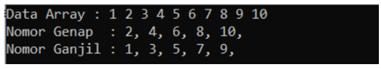
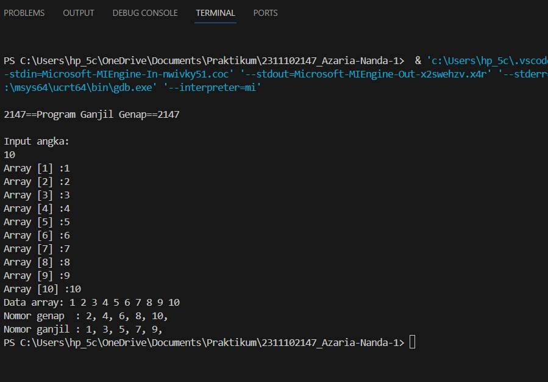
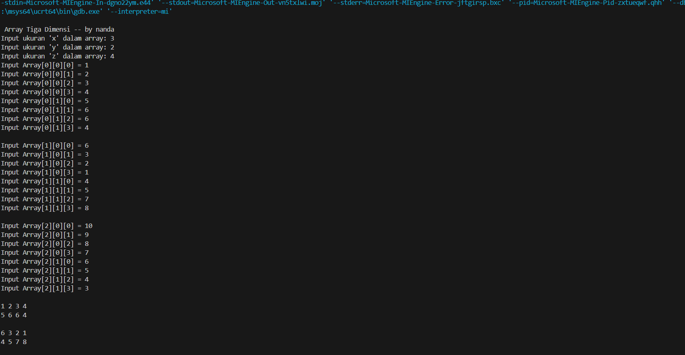
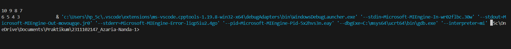
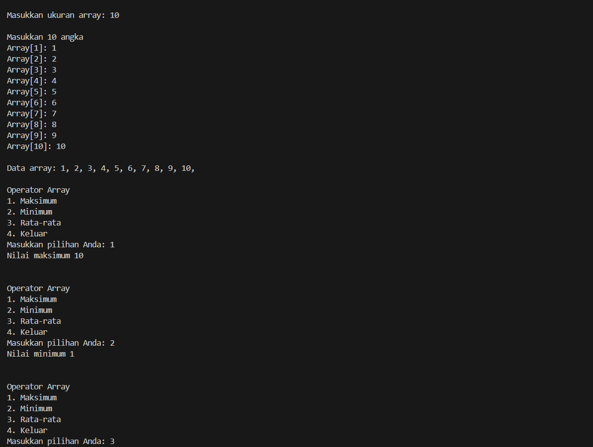
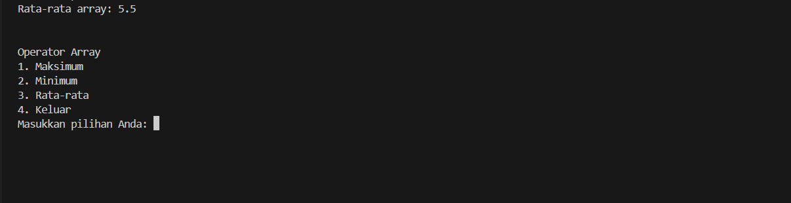

# <h1 align="center">Laporan Praktikum Modul Array</h1>
<p align="center">Azaria Nanda Putri - 2311102147</p>

## Dasar Teori
Array merupakan sekumpulan nilai yang tersusun dalam urutan tertentu dan dikenali melalui indeks atau kunci. Tiap nilai dalam array disebut elemen, dan dapat diakses melalui indeks atau kunci yang bersesuaian.

    -Array satu dimensi tidak lain adalah kumpulan elemen-elemen identik yang tersusun dalam satu baris. Elemen-elemen tersebut memiliki tipe data yang sama, tetapi isi dari elemen tersebut boleh berbeda.

    Pendeklarasian array diawali dengan penyebutan tipe data diikuti nama variabel array, diikuti dengan jumlah elemen. Jika array hendak diberi nilai awal, nilai-nilai awal dapat dituliskan dalam inisialisasi. Jika inisialisasi kurang dari jumlah elemen array, sisanya
    akan diinisialisasikan dengan nol.
    
    Elemen array diakses dengan menyebutkan indeks posisi elemen tersebut dalam array seperti pada contoh berikut. Ingatlah bahwa
    elemen pertama array memiliki indeks 0. 
    
    Contoh:
    // Tinggi Badan memiliki 100 elemen unsigned int Tinggi Badan [100];
    Tinggi Badan [0] = 7;
    Tinggi Badan [5] = 16;
    temp Tinggi Badan [99];

    -Array dua dimensi, sering digambarkan sebagai matriks yang memiliki perluasan dari array satu dimensi. Jika array satu dimensi hanya memiliki satu baris dengan beberapa elemen kolom, maka array dua dimensi memiliki beberapa baris dan beberapa kolom elemen yang memiliki tipe yang sama.

    Pendeklarasian array dua dimensi hampir sama dengan pendeklarasian array satu dimensi, kecuali bahwa array dua dimensi terdapat dua jumlah elemen array yang terdapat di dalam kurung siku dan keduanya boleh tidak sama.
    Elemen array dua dimensi diakses dengan menuliskan kedua indeks elemennya dalam kurung siku.

    contoh:
    // Papan memiliki 2 baris dan 5 kolom
    bool Papan [2] [5];
    Papan [0] [0] = true;
    Papan [0] [4] = false;
    Papan [1] [2] = true;
    Papan [1] [4] = false

    -Array multidimensi, kita bisa menjelaskannya sebagai kumpulan array, di mana setiap array berada di dalam array lainnya.
    
    Pendeklarasian array multidimensi ini pada dasarnya serupa dengan pendeklarasian array satu dimensi, dengan menambahkan tanda kurung siku [] sesuai dengan jumlah dimensi yang diinginkan.

    Contoh:
    int [] [] arr2; //-> Array 2 dimensi
    int [] [] [] arr3; //-> Array 3 dimensi
    int[][][][] arr4; //-> Array 4 dimensi
    
    
## Guided 

### 1. Program Input Array Tiga Dimensi

```C++
#include <iostream>

 using namespace std;

 // PROGRAM INPUT ARRAY 3 DIMENSI
 int main()
 {
    // Deklarasi array
    int arr[2][3][3];
    // Input elemen
    for (int x = 0; x < 2; x++)
    {
        for (int y = 0; y < 3; y++)
        {
            for (int z = 0; z < 3; z++)
            {
                cout << "Input Array[" << x << "][" << y << "][" << z << "] = ";

                cin >> arr[x][y][z];
            }
         }
        cout << endl;
    }
    // Output Array
    for (int x = 0; x < 2; x++)
    {
        for (int y = 0; y < 3; y++)
        {
            for (int z = 0; z < 3; z++)
            {
                cout << "Data Array[" << x << "][" << y << "][" << z << "] = " << arr[x][y][z] << endl;
            }
        }
    }
    cout << endl;
    // Tampilan array
    for (int x = 0; x < 2; x++)
    {
        for (int y = 0; y < 3; y++)
        {
            for (int z = 0; z < 3; z++)
            {
                cout << arr[x][y][z] << ends;
            }
            cout << endl;
        }
        cout << endl;
    }
 }
```
Kode di atas adalah sebuah program yang digunakan untuk menyimpan nilai-nilai dalam sebuah tabel tiga dimensi. Pengguna diminta untuk menambahkan angka-angka ke dalam tabel tersebut dengan cara memberikan informasi tentang baris, kolom, dan nilai di dalam kotak tersebut. Setelah selesai, program menampilkan kembali nilai-nilai tersebut dalam bentuk tabel bersama dengan nomor kotaknya. Selain itu, program juga menampilkan nilai-nilai tersebut tanpa tanda kurung siku.

### 2. Program Mencari Nilai Maksimal pada Array

```C++
#include <iostream>

using namespace std;

// Program Mencari Nilai Maksimal pada Array

int main()
{
    int maks, a, i = 1, lokasi;
    cout << "Masukkan panjang array: ";
    cin >> a;
    int array[a];
    cout << "Masukkan " << a << " angka\n";
    for (i = 0; i < a; i++)
    {
        cout << "Array ke-" << (i) << ": ";
        cin >> array[i];
    }
    maks = array[0];
    for (i = 0; i < a; i++)
    {
        if (array[i] > maks)
        {
            maks = array[i];
            lokasi = i;
        }
    }
    cout << "Nilai maksimum adalah " << maks << " berada di Array ke " << lokasi << endl;
}
```
Kode di atas bertujuan untuk mencari nilai maksimum dalam suatu array setelah pengguna memasukkan panjang array dan nilai-nilai elemennya. Setelah memasukkan nilai-nilai, program akan menggunakan perulangan for dan if untuk mencari nilai maksimum. Nilai maksimum tersebut akan disimpan dalam variabel maks dan indeksnya dalam variabel lokasi. Program kemudian akan menampilkan nilai maksimum beserta indeksnya.

## Unguided 

### 1. Buatlah program untuk menampilkan output seperti berikut dengan data yang diinputkan oleh user!


```C++
#include <iostream>
#include <vector>

using namespace std;

int main() {
    int a_2147;

    cout << "\n2147==Program Ganjil Genap==2147" << endl;
    cout << "\nInput angka: " << endl;
    cin >> a_2147;

    vector<int> Array_2147; 

    for (int i = 0; i < a_2147; i++) {
        cout << "Array " << "[" << i + 1 << "]" << " :";
        int num;
        cin >> num;
        Array_2147.push_back(num);
    }
    cout << "Data array: ";
    for (int i = 0; i < a_2147; ++i) { 
        cout << Array_2147[i] << " ";
    }
    cout << endl;
    cout << "Nomor genap  : ";
    for (int i = 0; i < a_2147; ++i) { 
        if (Array_2147[i] % 2 == 0)
            cout << Array_2147[i] << ", ";
    }
    cout << endl;
    cout << "Nomor ganjil : ";
    for (int i = 0; i < a_2147; ++i) { 
        if (Array_2147[i] % 2 != 0)
            cout << Array_2147[i] << ", ";
    }
    cout << endl;

    return 0;
}
```
#### Output:


kode berikut merupakan kode sederhana yang memisahkan bilangan ganjil dan genap dari input pengguna. Langkah-langkahnya termasuk deklarasi header file yang diperlukan, inisialisasi variabel untuk menyimpan jumlah bilangan yang dimasukkan, penginputan bilangan, penyimpanan bilangan dalam vektor, pencetakan kembali bilangan, pencetakan bilangan genap dan ganjil, serta pengakhiran eksekusi. Program ini mengilustrasikan penggunaan vektor dan loop dalam C++ untuk memproses input pengguna.

### 2. Buatlah program input array tiga dimensi (seperti pada guided) tetapi jumlah atau ukuran elemennya diinputkan oleh user!

```C++
#include <iostream>
using namespace std;

int main()
{
   
    int ukurax_2147, ukurany_2147, ukuranz_2147;
    cout << "\n Array Tiga Dimensi -- by nanda" << endl;
    cout << "Input ukuran 'x' dalam array: "; cin >> ukurax_2147;
    cout << "Input ukuran 'y' dalam array: "; cin >> ukurany_2147;
    cout << "Input ukuran 'z' dalam array: "; cin >> ukuranz_2147;

    int arr[ukurax_2147][ukurany_2147][ukuranz_2147];
    for (int x = 0; x < ukurax_2147; x++) {
        for (int y = 0; y < ukurany_2147; y++) {
            for (int z = 0; z < ukuranz_2147; z++) {
                cout << "Input Array[" << x << "][" << y << "][" << z << "] = ";
                cin >> arr[x][y][z];
            }
        }
        cout << endl;
    }
    for (int x = 0; x < ukurax_2147; x++) {
        for (int y = 0; y < ukurany_2147; y++) {
            for (int z = 0; z < ukuranz_2147; z++) {
                cout << arr[x][y][z] << " ";
            }
            cout << endl;
        }
        cout << endl;
    }
    return 0;
}
```
#### Output:



Kode di atas menggunakan C++ untuk menunjukkan penggunaan array tiga dimensi yang memungkinkan penyimpanan data dalam tiga dimensi dengan tiga indeks. Setelah pengguna memasukkan ukuran x, y, dan z, program membuat array sesuai dengan ukuran yang dimasukkan. Dengan perulangan bersarang, pengguna diminta memasukkan nilai untuk setiap elemen array, yang kemudian dicetak oleh program. Akhirnya, program berakhir dengan mengembalikan nilai 0, memberikan kemampuan kepada pengguna untuk mengelola array tiga dimensi sesuai kebutuhan.

### 3. Buatlah program menu untuk mencari nilai maksimum, minimum dan nilai rata – rata dari suatu array dengan input yang dimasukkan oleh user!

```C++
#include <iostream>

using namespace std;

void maksimum(int arr[], int size) {
    int max = arr[0];
    for (int i = 1; i < size; i++) {
        if (arr[i] > max) {
            max = arr[i];
        }
    }
    cout << "Nilai maksimum " << max << endl;
}

void minimum(int arr[], int size) {
    int min = arr[0];
    for (int i = 1; i < size; i++) {
        if (arr[i] < min) {
            min = arr[i];
        }
    }
    cout << "Nilai minimum " << min << endl;
}

void rata_rata(int arr[], int size) {
    int sum = 0;
    for (int i = 0; i < size; i++) {
        sum += arr[i];
    }
    double average = static_cast<double>(sum) / size;
    cout << "Rata-rata array: " << average << endl;
}
int main() {
    int size, pilihan;
    cout << "Masukkan ukuran array: ";
    cin >> size;
    int Array[size];
    cout << "\nMasukkan " << size << " angka\n";
    for (int i = 0; i < size; i++) {
        cout << "Array[" << i + 1 << "]: ";
        cin >> Array[i];
    }
    cout << "\nData array: ";
    for (int i = 0; i < size; i++) {
        cout << Array[i] << ", ";
    }
    do {cout << "\n\nOperator Array\n";
        cout << "1. Maksimum\n";
        cout << "2. Minimum\n";
        cout << "3. Rata-rata\n";
        cout << "4. Keluar\n";
        cout << "Masukkan pilihan Anda: ";
        cin >> pilihan;
        switch (pilihan) {
            case 1:
                maksimum(Array, size);
                break;
            case 2:
                minimum(Array, size);
                break;
            case 3:
                rata_rata(Array, size);
                break;
            case 4:
                cout << "Terima kasih telah menggunakan program!" << endl;
                break;
            default:
                cout << "Pilihan tidak valid!" << endl;
        }
    } while (pilihan != 4);
    return 0;
}
```
#### Output:



kode diatas digunakan untuk melakukan operasi seperti mencari nilai maksimum, minimum, dan rata-rata. Pengguna memasukkan angka ke dalam sebuah array, Setelah memasukkan ukuran array dan angka-angka, program memberikan opsi operasi kepada pengguna. Fungsi terpisah digunakan untuk setiap operasi, dan pengguna diberi opsi untuk melakukan operasi lain atau keluar. Program berakhir dengan pesan terima kasih setelah pengguna memilih untuk keluar. Ini memberikan pengguna kemampuan untuk mengelola dan melakukan operasi pada array angka dengan sederhana.

## Kesimpulan
Array adalah suatu struktur yang terdiri dari sejumlah elemen yang memiliki tipe data yang sama. Elemen-elemen array tersusun secara sekuensial dalam memori komputer. Array dapat berupa satu dimensi, dua dimensi, tiga dimensi, ataupun banyak dimensi.

    -Array satu dimensi tidak lain adalah kumpulan elemen-elemen identik yang tersusun dalam satu baris. Elemen-elemen tersebut memiliki tipe data yang sama, tetapi isi dari elemen tersebut boleh berbeda.

    -Array dua dimensi, sering digambarkan sebagai matriks yang memiliki perluasan dari array satu dimensi. Jika array satu dimensi hanya memiliki satu baris dengan beberapa elemen kolom, maka array dua dimensi memiliki beberapa baris dan beberapa kolom elemen yang memiliki tipe yang sama.

    -Array multidimensi, kita bisa menjelaskannya sebagai kumpulan array, di mana setiap array berada di dalam array lainnya. Pendeklarasian array multidimensi ini pada dasarnya serupa dengan pendeklarasian array satu dimensi, dengan menambahkan tanda kurung siku [] sesuai dengan jumlah dimensi yang diinginkan.

## Referensi
[1] Indrajani Martin., Pemrograman Objek Dengan C++. Jakarta: Elex media, 2019.<br/>
[2] Ira Siregar., Gemar Belajar Struktur Data. Jakarta: Buku kita, 2019.
[3] Dr. Joseph Teguh Santoso., Struktur Data dan ALgoritma. Semarang: Yayasan Prima Agus Teknik, 2021.

