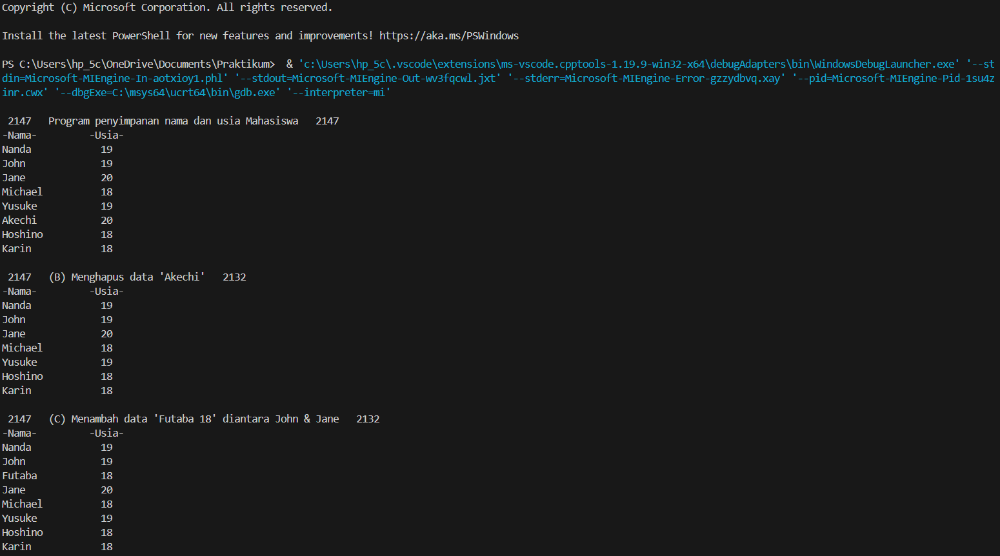
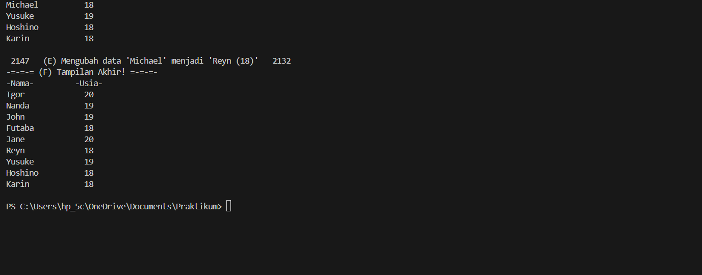
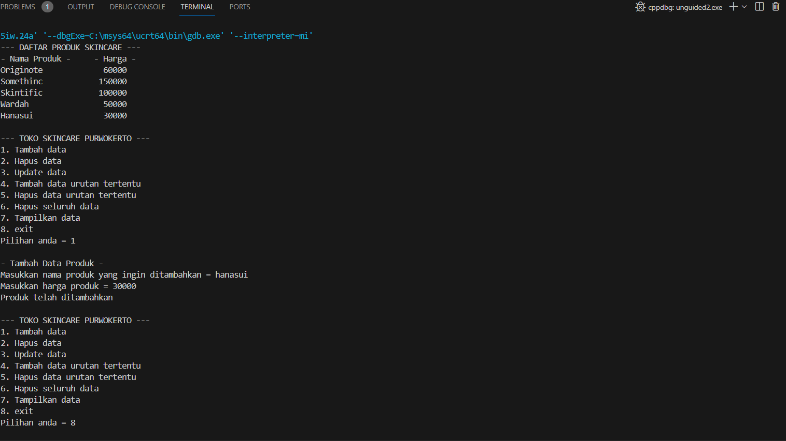

# <h1 align="center">Laporan Praktikum Modul Array</h1>
<p align="center">Azaria Nanda Putri - 2311102147</p>

## Dasar Teori
LLinked list adalah kumpulan elemen yang terhubung melalui pointer. Setiap elemen memiliki pointer yang menyimpan alamat memori, bisa berupa data atau pointer lain. Elemen pertama disebut head, dan jika kosong, head menunjuk ke NULL. Elemen terakhir disebut tail dengan pointer yang menunjuk ke NULL. Linked list memungkinkan penyimpanan data dengan alokasi memori dinamis, dan mudah dalam penambahan serta penghapusan elemen, namun ia memiliki kelemahan dalam akses acak yang lambat dan kebutuhan ruang ekstra untuk pointer. Linked list sering digunakan untuk data yang sering mengalami perubahan dan membutuhkan fleksibilitas dalam operasi penambahan atau penghapusan. Selain itu, linked list juga sering digunakan dalam implementasi struktur data lain seperti stack, queue, dan graph.

- Single Linked List</br>
    Dalam Single Linked List, operasi umum meliputi penambahan dan penghapusan simpul di awal atau akhir, serta pencarian dan pengambilan nilai pada simpul tertentu. Karena hanya memerlukan satu pointer per simpul, Single Linked List lebih efisien dalam penggunaan memori dibandingkan Double Linked List dan Circular Linked List. Circular Linked List memiliki penunjuk next pada node terakhir yang selalu merujuk ke node pertama.

- Double linked list </br>
   Double Linked List adalah struktur data Linked List dengan tambahan pointer prev pada setiap simpul, yang menunjuk ke simpul sebelumnya. Dengan fitur ini, operasi penghapusan dan penambahan pada simpul dapat dilakukan secara efisien. Setiap simpul memiliki tiga elemen: elemen data, pointer next, dan pointer prev. Keuntungannya adalah kemampuan melakukan operasi penambahan dan penghapusan simpul dengan efisien serta traversal mudah dari depan dan belakang. Namun, Double Linked List menggunakan memori lebih banyak dan memerlukan waktu eksekusi lebih lama dibandingkan Single Linked List dalam operasi penambahan dan penghapusan.
    
    
## Guided 

### 1. Latihan Single Linked List

```C++
// Latihan Single Linked List

#include <iostream>
using namespace std;

///PROGRAM SINGLE LINKED LIST NON-CIRCULAR
//Deklarasi Struct Node
struct Node {
    int data;
    Node* next;
};

Node* head;
Node* tail;

//Inisialisasi Node
void init() {
    head = NULL;
    tail = NULL;
}

// Pengecekan
bool isEmpty() {
    if (head == NULL)
        return true;
    else
        return false;
}

//Tambah Depan
void insertDepan(int nilai) {
    //Buat Node baru
    Node* baru = new Node;
    baru->data = nilai;
    baru->next = NULL;

    if (isEmpty() == true) {
        head = tail = baru;
        tail->next = NULL;
    }
    else {
        baru->next = head;
        head = baru;
    }
}

//Tambah Belakang
void insertBelakang(int nilai) {
    //Buat Node baru
    Node* baru = new Node;
    baru->data = nilai;
    baru->next = NULL;

    if (isEmpty() == true) {
        head = tail = baru;
        tail->next = NULL;
    }
    else {
        tail->next = baru;
        tail = baru;
    }
}

//Hitung Jumlah List
int hitungList() {
    Node* hitung;
    hitung = head;
    int jumlah = 0;

    while (hitung != NULL) {
        jumlah++;
        hitung = hitung->next;
    }

    return jumlah;
}

//Tambah Tengah
void insertTengah(int data, int posisi) {
    if (posisi < 1 || posisi > hitungList()) {
        cout << "Posisi diluar jangkauan" << endl;
    }
    else if (posisi == 1) {
        cout << "Posisi bukan posisi tengah" << endl;
    }
    else {
        Node* baru, * bantu;
        baru = new Node();
        baru->data = data;

        // tranversing
        bantu = head;
        int nomor = 1;

        while (nomor < posisi - 1) {
            bantu = bantu->next;
            nomor++;
        }

        baru->next = bantu->next;
        bantu->next = baru;
    }
}

//Hapus Depan
void hapusDepan() {
    Node* hapus;

    if (isEmpty() == false) {
        if (head->next != NULL) {
            hapus = head;
            head = head->next;
            delete hapus;
        }
        else {
            head = tail = NULL;
        }
    }
    else {
        cout << "List kosong!" << endl;
    }
}

//Hapus Belakang
void hapusBelakang() {
    Node* hapus;
    Node* bantu;

    if (isEmpty() == false) {
        if (head != tail) {
            hapus = tail;
            bantu = head;

            while (bantu->next != tail) {
                bantu = bantu->next;
            }

            tail = bantu;
            tail->next = NULL;
            delete hapus;
        }
        else {
            head = tail = NULL;
        }
    }
    else {
        cout << "List kosong!" << endl;
    }
}

//Hapus Tengah
void hapusTengah(int posisi) {
    Node* hapus, * bantu, * bantu2;

    if (posisi < 1 || posisi > hitungList()) {
        cout << "Posisi di luar jangkauan" << endl;
    }
    else if (posisi == 1) {
        cout << "Posisi bukan posisi tengah" << endl;
    }
    else {
        int nomor = 1;
        bantu = head;

        while (nomor <= posisi) {
            if (nomor == posisi - 1) {
                bantu2 = bantu;
            }

            if (nomor == posisi) {
                hapus = bantu;
            }

            bantu = bantu->next;
            nomor++;
        }

        bantu2->next = bantu;
        delete hapus;
    }
}

//Ubah Depan
void ubahDepan(int data) {
    if (isEmpty() == false) {
        head->data = data;
    }
    else {
        cout << "List masih kosong!" << endl;
    }
}

//Ubah Tengah
void ubahTengah(int data, int posisi) {
    Node* bantu;

    if (isEmpty() == false) {
        if (posisi < 1 || posisi > hitungList()) {
            cout << "Posisi di luar jangkauan" << endl;
        }
        else if (posisi == 1) {
            cout << "Posisi bukan posisi tengah" << endl;
        }
        else {
            bantu = head;
            int nomor = 1;

            while (nomor < posisi) {
                bantu = bantu->next;
                nomor++;
            }

            bantu->data = data;
        }
    }
    else {
        cout << "List masih kosong!" << endl;
    }
}

//Ubah Belakang
void ubahBelakang(int data) {
    if (isEmpty() == false) {
        tail->data = data;
    }
    else {
        cout << "List masih kosong!" << endl;
    }
}

//Hapus List
void clearList() {
    Node* bantu, * hapus;
    bantu = head;

    while (bantu != NULL) {
        hapus = bantu;
        bantu = bantu->next;
        delete hapus;
    }

    head = tail = NULL;
    cout << "List berhasil terhapus!" << endl;
}

//Tampilkan List
void tampil() {
    Node* bantu;
    bantu = head;

    if (isEmpty() == false) {
        while (bantu != NULL) {
            cout << bantu->data << ends;
            bantu = bantu->next;
        }

        cout << endl;
    }
    else {
        cout << "List masih kosong!" << endl;
    }
}

int main() {
    init();
    insertDepan(3);
    tampil();
    insertBelakang(5);
    tampil();
    insertDepan(2);
    tampil();
    insertDepan(1);
    tampil();
    hapusDepan();
    tampil();
    hapusBelakang();
    tampil();
    insertTengah(7, 2);
    tampil();
    hapusTengah(2);
    tampil();
    ubahDepan(1);
    tampil();
    ubahBelakang(8);
    tampil();
    ubahTengah(11, 2);
    tampil();

    return 0;
}
```
Kode di atas digunakan untuk menjalankan single linked list. Struct node dideklarasikan dengan int data dan Node* next, serta inisialisasi node dilakukan melalui prosedur void init() dengan head dan tailnya dideklarasikan NULL. Fungsi bool isEmpty() juga disediakan untuk mengecek apakah linked list kosong atau tidak. Dalam int main(), berbagai fungsi akan dipanggil untuk operasi-operasi seperti penambahan dan penghapusan data, serta modifikasi data di berbagai posisi. Fungsi-fungsi tersebut antara lain: insertDepan(), insertBelakang(), hitungList(), insertTengah(), hapusDepan(), hapusBelakang(), hapusTengah(), ubahDepan(), ubahTengah(), ubahBelakang(), clearList(), dan tampil(). Setelah pendeklarasian fungsi-fungsi tersebut di int main(), hasil akhir dari kode tersebut adalah 111.

### 2. Latihan Double Linked List

```C++
// Latihan Double Linked List
#include <iostream>
using namespace std;

class Node {
public:
    int data;
    Node* prev;
    Node* next;
};

class DoublyLinkedList {
public:
    Node* head;
    Node* tail;

    DoublyLinkedList() {
        head = nullptr;
        tail = nullptr;
    }

    void push(int data) {
        Node* newNode = new Node;
        newNode->data = data;
        newNode->prev = nullptr;
        newNode->next = head;

        if (head != nullptr) {
            head->prev = newNode;
        }
        else {
            tail = newNode;
        }

        head = newNode;
    }

    void pop() {
        if (head == nullptr) {
            return;
        }

        Node* temp = head;
        head = head->next;

        if (head != nullptr) {
            head->prev = nullptr;
        }
        else {
            tail = nullptr;
        }

        delete temp;
    }

    bool update(int oldData, int newData) {
        Node* current = head;

        while (current != nullptr) {
            if (current->data == oldData) {
                current->data = newData;
                return true;
            }
            current = current->next;
        }

        return false;
    }

    void deleteAll() {
        Node* current = head;

        while (current != nullptr) {
            Node* temp = current;
            current = current->next;
            delete temp;
        }

        head = nullptr;
        tail = nullptr;
    }

    void display() {
        Node* current = head;

        while (current != nullptr) {
            cout << current->data << " ";
            current = current->next;
        }

        cout << endl;
    }
};

int main() {
    DoublyLinkedList list;

    while (true) {
        cout << "1. Add data" << endl;
        cout << "2. Delete data" << endl;
        cout << "3. Update data" << endl;
        cout << "4. Clear data" << endl;
        cout << "5. Display data" << endl;
        cout << "6. Exit" << endl;

        int choice;
        cout << "Enter your choice: ";
        cin >> choice;

        switch (choice) {
            case 1: {
                int data;
                cout << "Enter data to add: ";
                cin >> data;
                list.push(data);
                break;
            }
            case 2: {
                list.pop();
                break;
            }
            case 3: {
                int oldData, newData;
                cout << "Enter old data: ";
                cin >> oldData;
                cout << "Enter new data: ";
                cin >> newData;

                bool updated = list.update(oldData, newData);

                if (!updated) {
                    cout << "Data not found" << endl;
                }
                break;
            }
            case 4: {
                list.deleteAll();
                break;
            }
            case 5: {
                list.display();
                break;
            }
            case 6: {
                return 0;
            }
            default: {
                cout << "Invalid choice" << endl;
                break;
            }
        }
    }

    return 0;
}
```
Kode tersebut adalah implementasi dari double linked list yang terdiri dari dua kelas utama: Node dan DoublyLinkedList. Dalam kelas Node, terdapat tiga atribut: int data, Node* prev, dan Node* next. Sedangkan kelas DoublyLinkedList memiliki dua pointer: Node* head dan Node* tail. Konstruktor DoublyLinkedList() berfungsi untuk menginisialisasi head dan tail dengan nullptr. Program ini dilengkapi dengan beberapa fungsi, yaitu push(), pop(), update(), deleteAll(), dan display(), yang didefinisikan dalam fungsi main(). Dalam main(), objek DoublyLinkedList list dideklarasikan dan menu ditampilkan untuk memungkinkan pengguna melakukan operasi seperti penambahan, penghapusan, pembaruan, penghapusan semua data, dan penampilan data. Program ini berjalan dalam loop while yang terus berlangsung selama input dari pengguna valid (true).

## Unguided 

### 1. Buatlah program menu Single Linked List Non-Circular untuk menyimpan Nama dan Usia mahasiswa, dengan menggunakan inputan dari user. Lakukan operasi berikut:</br> ㅤa. Masukkan data sesuai urutan berikut. (Gunakan insert depan, belakang atau tengah). Data pertama yang dimasukkan adalah nama dan usia anda.</br> ㅤb. Hapus data Akechi</br> ㅤc. Tambahkan data berikut diantara John dan Jane: "Futaba 18"</br> ㅤd. Tambahkan data berikut di awal: "Igor 20"</br> ㅤe. Ubah data Michael menjadi: "Reyn 18"</br> ㅤf. Tampilkan seluruh data

```C++
//Coding by Azaria Nanda Putri - 2311102147

#include <iostream>
#include <iomanip>

using namespace std;

//Deklarasi Struct Node
struct Node {
    string Nama_2147;
    int Umur_2147;
    Node* next;
};

Node* head;
Node* tail;

//Inisialisasi Node
void init_2147() {
    head = NULL;
    tail = NULL;
}

// Pengecekan
bool Empty_2147() {
    if (head == NULL)
        return true;
    else
        return false;
}

//Tambah Depan
void InsertDepan_2147(string nama, int umur) {
    //Buat Node baru
    Node* baru = new Node;
    baru->Nama_2147 = nama;
    baru->Umur_2147 = umur;
    baru->next = NULL;

    if (Empty_2147() == true) {
        head = tail = baru;
        tail->next = NULL;
    }
    else {
        baru->next = head;
        head = baru;
    }
}

//Tambah Belakang
void InsertBelakang_2147(string nama, int umur) {
    //Buat Node baru
    Node* baru = new Node;
    baru->Nama_2147 = nama;
    baru->Umur_2147 = umur;
    baru->next = NULL;

    if (Empty_2147() == true) {
        head = tail = baru;
        tail->next = NULL;
    }
    else {
        tail->next = baru;
        tail = baru;
    }
}

//Hitung Jumlah List
int HitungList_2147() {
    Node* hitung;
    hitung = head;
    int jumlah = 0;

    while (hitung != NULL) {
        jumlah++;
        hitung = hitung->next;
    }

    return jumlah;
}

//Tambah Tengah
void InsertTengah_2147(string nama, int umur, int posisi) {
    if (posisi < 1 || posisi > HitungList_2147()) {
        cout << "Posisiton out of range!" << endl;
    }
    else if (posisi == 1) {
        cout << "The position is not in the middle!" << endl;
    }
    else {
        Node* baru, * bantu;
        baru = new Node();
        baru->Nama_2147 = nama;
        baru->Umur_2147 = umur;

        // tranversing
        bantu = head;
        int nomor = 1;

        while (nomor < posisi - 1) {
            bantu = bantu->next;
            nomor++;
        }

        baru->next = bantu->next;
        bantu->next = baru;
    }
}

//Hapus Depan
void HapusDepan_2147() {
    Node* hapus;

    if (Empty_2147() == false) {
        if (head->next != NULL) {
            hapus = head;
            head = head->next;
            delete hapus;
        }
        else {
            head = tail = NULL;
        }
    }
    else {
        cout << "Nothing there." << endl;
    }
}

//Hapus Belakang
void HapusBelakang_2147() {
    Node* hapus;
    Node* bantu;

    if (Empty_2147() == false) {
        if (head != tail) {
            hapus = tail;
            bantu = head;

            while (bantu->next != tail) {
                bantu = bantu->next;
            }

            tail = bantu;
            tail->next = NULL;
            delete hapus;
        }
        else {
            head = tail = NULL;
        }
    }
    else {
        cout << "Nothing there." << endl;
    }
}

//Hapus Tengah
void HapusTengah_2147(int posisi) {
    Node* hapus, * bantu, * bantu2;

    if (posisi < 1 || posisi > HitungList_2147()) {
        cout << "Posisiton out of range!" << endl;
    }
    else if (posisi == 1) {
        cout << "The position is not in the middle!" << endl;
    }
    else {
        int nomor = 1;
        bantu = head;

        while (nomor <= posisi) {
            if (nomor == posisi - 1) {
                bantu2 = bantu;
            }

            if (nomor == posisi) {
                hapus = bantu;
            }

            bantu = bantu->next;
            nomor++;
        }

        bantu2->next = bantu;
        delete hapus;
    }
}

//Ubah Depan
void UbahDepan_2147(string nama, int umur) {
    if (Empty_2147() == false) {
        head->Nama_2147 = nama;
        head->Umur_2147 = umur;
    }
    else {
        cout << "It's the same?" << endl;
    }
}

//Ubah Tengah
void UbahTengah_2147(string nama, int umur, int posisi) {
    Node* bantu;

    if (Empty_2147() == false) {
        if (posisi < 1 || posisi > HitungList_2147()) {
            cout << "Posisiton out of range!" << endl;
        }
        else if (posisi == 1) {
            cout << "The position is not in the middle!" << endl;
        }
        else {
            bantu = head;
            int nomor = 1;

            while (nomor < posisi) {
                bantu = bantu->next;
                nomor++;
            }

            bantu->Nama_2147 = nama;
            bantu->Umur_2147 = umur;
        }
    }
    else {
        cout << "Nothing there." << endl;
    }
}

//Ubah Belakang
void UbahBelakang_2147(string nama, int umur) {
    if (Empty_2147() == false) {
        tail->Nama_2147 = nama;
        tail->Umur_2147 = umur;
    }
    else {
        cout << "Nothing there." << endl;
    }
}

//Hapus List
void HapusList_2147() {
    Node* bantu, * hapus;
    bantu = head;

    while (bantu != NULL) {
        hapus = bantu;
        bantu = bantu->next;
        delete hapus;
    }

    head = tail = NULL;
    cout << "Nice, the list have been deleted." << endl;
}

//Tampilkan List
void Tampil_2147() {
    Node* bantu;
    bantu = head;

    cout << left << setw(15) << "-Nama-" << right << setw(4) << "-Usia-" << endl; // Supaya rapi

    if (Empty_2147() == false) {
        while (bantu != NULL) {
            cout << left << setw(15) << bantu->Nama_2147 << right << setw(4) << bantu->Umur_2147 << endl; // Supaya lurus di output
            bantu = bantu->next;
        }

        cout << endl;
    }
    else {
        cout << "Nothing there." << endl;
    }
}

int main() {
    init_2147(); // Inisialisasi Linked List
    cout << "\n 2147   Program penyimpanan nama dan usia Mahasiswa   2147 " << endl; // Menampilkan point a 
    InsertDepan_2147("Karin", 18);
    InsertDepan_2147("Hoshino", 18);
    InsertDepan_2147("Akechi", 20); 
    InsertDepan_2147("Yusuke", 19);
    InsertDepan_2147("Michael", 18);
    InsertDepan_2147("Jane", 20);
    InsertDepan_2147("John", 19);
    InsertDepan_2147("Nanda", 19);
    Tampil_2147 ();

    // Poin b
    cout << " 2147   (B) Menghapus data 'Akechi'   2132 " << endl;
    HapusTengah_2147(6);
    Tampil_2147();

    // Poin c
    cout << " 2147   (C) Menambah data 'Futaba 18' diantara John & Jane   2132 " << endl;
    InsertTengah_2147("Futaba", 18, 3);
    Tampil_2147();

    // Poin d
    cout << " 2147   (D) Menambah data 'Igor 20' di awal   2132 " << endl;
    InsertDepan_2147("Igor", 20);
    Tampil_2147();

    // Poin e & f
    cout << " 2147   (E) Mengubah data 'Michael' menjadi 'Reyn (18)'   2132 " << endl;
    cout << "-=-=-= (F) Tampilan Akhir! =-=-=-" << endl;
    UbahTengah_2147("Reyn", 18, 6);
    Tampil_2147();

    return 0;
}
```
#### Output:



Kode di atas adalah implementasi single linked list dengan node yang memiliki integer data dan pointer next. Inisialisasi menggunakan void init(), dan pointer head dan tail diatur nullptr. Fungsi bool IsEmpty() memeriksa apakah linked list kosong. Fungsi lainnya meliputi: insertDepan(int value), insertBelakang(int value), jumlah(), insertTengah(int value, int posisi), hapusDepan(), hapusBelakang(), hapusTengah(int posisi), tampil(), ubahDepan(int value), ubahBelakang(int value), dan ubahTengah(int value, int posisi). Pada main(), program inisialisasi linked list, lalu menampilkan data, menghapus 'Akechi', menambah 'Futaba (18)' dan 'Igor (20)', mengubah 'Michael' menjadi 'Reyn (18)', dan menampilkan data lagi.


### 2. Buatlah program input array tiga dimensi (seperti pada guided) tetapi jumlah atau ukuran elemennya diinputkan oleh user!

```C++
#include<iostream>
#include<iomanip>

using namespace std;

struct node{
    string barang_151;
    int harga_151;
    node *prev;
    node *next;
};
    node *head;
    node *tail;

//prosedur inisiaslisasi 
void Inisialisasi_151(){
    head = nullptr;
    tail = nullptr;
}

//prosedur tambah node
void TambahNode_151(string produk_151, int harga_151, int posisi_151){
    if(posisi_151 < 1 ){
        cout << "Node yang ingin ditambah diluar jangkauan" << endl;
    } else if(posisi_151 == 1){
        node *baru = new node;
        baru->barang_151 = produk_151;
        baru->harga_151 = harga_151;
        baru->next = head;
        baru->prev = nullptr;
        if(head != nullptr){
            head->prev = baru;
        } else {
            tail = baru;
        }
        head = baru;
    } else {
        node *current = head;
        node *baru = new node;
        baru->barang_151 = produk_151;
        baru->harga_151 = harga_151;
        baru->next = nullptr;
        baru->prev = nullptr;
        int hitung_151 = 1;
        while(hitung_151 < posisi_151 - 1){
            hitung_151++;
            current = current->next;
        }
        baru->next = current->next;
        baru->prev = current;
        if(current->next != nullptr){
            current->next->prev = baru;
        } else {
            tail = baru;
        }
        current->next = baru;
    }
}

//prosedur hapus node
void HapusNode_151(int posisi_151){
    if(posisi_151 < 1){
        cout << "Posisi node yang ingin dihapus diluar jangkauan" << endl;
    } else if(posisi_151 == 1){
        node *current = head;  // Simpan node pertama
        head = head->next;     // Geser head ke node berikutnya
        if(head != nullptr) {
            head->prev = nullptr;  // Tetapkan nullptr ke prev dari node baru pertama
        }
        delete current;  // Hapus node pertama
    } else {
        node *current = head;
        int hitung_151 = 1;
        while(hitung_151 < posisi_151){
            hitung_151++;
            current = current->next;
        }
        current->prev->next = current->next;
        current->next->prev = current->prev;
        delete current;
    }
}

//fungsi update data
bool UpdateData_151(string ProdukLama_151, string ProdukBaru_151, int HargaBaru_151){
    node *current = head;
    while (current != nullptr){
        if(current->barang_151 == ProdukLama_151){
            current->barang_151 = ProdukBaru_151;
            current->harga_151 = HargaBaru_151;
            return true;
        }
        current = current->next;
    }
    return false;
}

//prosedur hapus semua data
void HapusSemua_151(){
    node *current = head;
    while(current != nullptr){
        node *temp = current;
        current = current->next;
        delete temp;
    }
    head = nullptr;
    tail = nullptr;
}

//prosedur tampilkan data
void TampilData_151(){
    node *current = head;
    if(head != nullptr){
        cout << left << setw(20) << "- Nama Produk -" << right << setw(5) << "- Harga -" << endl; 
        while(current != nullptr){
            cout << left << setw(20) << current->barang_151 << right << setw(7) << current->harga_151 << endl; 
            current = current->next;
        }
    }
    cout << endl;
}

int main(){
    int pilih_151, HargaBaru_151, PosisiProduk_151;
    string ProdukBaru_151, ProdukLama_151;
    char yakin_151;
    Inisialisasi_151();
    cout << "--- DAFTAR PRODUK SKINCARE ---" << endl;
    TambahNode_151("Hanasui", 30000, 1 );
    TambahNode_151("Wardah", 50000, 1);
    TambahNode_151("Skintific", 100000, 1);
    TambahNode_151("Somethinc", 150000, 1);
    TambahNode_151("Originote", 60000, 1);
    TampilData_151();

    MenuUtama:
    cout << "--- TOKO SKINCARE PURWOKERTO ---" << endl;
    cout << "1. Tambah data" << endl;
    cout << "2. Hapus data" << endl;
    cout << "3. Update data" << endl;
    cout << "4. Tambah data urutan tertentu" << endl;
    cout << "5. Hapus data urutan tertentu" << endl;
    cout << "6. Hapus seluruh data" << endl;
    cout << "7. Tampilkan data" << endl;
    cout << "8. exit" << endl;
    cout << "Pilihan anda = "; cin >> pilih_151;
    cout << endl;

    switch(pilih_151){
        case 1 :
            cout << "- Tambah Data Produk -" << endl;
            cout << "Masukkan nama produk yang ingin ditambahkan = "; cin >> ProdukBaru_151;
            cout << "Masukkan harga produk = "; cin >> HargaBaru_151;
            TambahNode_151(ProdukBaru_151, HargaBaru_151, 1);
            cout << "Produk telah ditambahkan" << endl;
            cout << endl;
            goto MenuUtama;
            break;
        case 2 :
            cout << "- Hapus Data Produk Pertama - " << endl;
            HapusNode_151(1);
            cout << "Data produk ke-1 telah dihapus" << endl;
            cout << endl;
            goto MenuUtama;
            break;
        case 3 :
            cout << "- Update Data Produk -" << endl;
            cout << "Masukkan produk lama yang ingin diganti = ";cin >> ProdukLama_151;
            cout << "Masukkan nama produk baru = "; cin >> ProdukBaru_151;
            cout << "Masukkan harga produk baru = "; cin >> HargaBaru_151;
            UpdateData_151(ProdukLama_151, ProdukBaru_151, HargaBaru_151);
            cout << "Produk telah diupdate" << endl;
            cout << endl;
            goto MenuUtama;
            break;
        case 4 :
            cout << "- Tambah Data Urutan Tertentu -" << endl;
            cout << "Masukkan nama produk yang ingin ditambahkan = "; cin >> ProdukBaru_151;
            cout << "Masukkan harga produk baru = "; cin >> HargaBaru_151;
            cout << "Masukkan posisi produk dalam database = "; cin >> PosisiProduk_151;
            TambahNode_151(ProdukBaru_151, HargaBaru_151, PosisiProduk_151);
            cout << "Produk telah ditambahkan" << endl;
            cout << endl;
            goto MenuUtama;
            break;
        case 5 :
            cout << "- Hapus Data Urutan Tertentu -" << endl;
            cout << "Masukkan urutan produk yang ingin dihapus = "; cin >> PosisiProduk_151;
            HapusNode_151(PosisiProduk_151);
            cout << "Data produk urutan ke-" << PosisiProduk_151 << " telah dihapus" << endl;
            cout << endl;
            goto MenuUtama;
            break;
        case 6 :
            cout << "- Hapus Seluruh Data -" << endl;
            cout << "Apakah anda yakin ingin menghapus semua produk? [y/n] = "; cin >> yakin_151;
            if(yakin_151 == 'y' || yakin_151 == 'Y'){
                HapusSemua_151();
                cout << "Semua data produk telah dihapus" << endl;
            } else if(yakin_151 == 'n' || yakin_151 == 'N'){
                cout << "Aksi dibatalkan" << endl;
            }
            cout << endl;
            goto MenuUtama;
            break;
        case 7 :
            cout << "- Tampilkan Data -" << endl;
            TampilData_151();
            cout << endl;
            goto MenuUtama;
            break;
        case 8 :
            cout << "Anda keluar dari program" << endl;
            return 0;
        default :
            cout << "Pilihan yang anda masukkan tidak tersedia" << endl;
            cout << endl;
            goto MenuUtama;
            break;
    }    
}
```
#### Output:



Kode di atas menggunakan C++ untuk menunjukkan penggunaan array tiga dimensi yang memungkinkan penyimpanan data dalam tiga dimensi dengan tiga indeks. Setelah pengguna memasukkan ukuran x, y, dan z, program membuat array sesuai dengan ukuran yang dimasukkan. Dengan perulangan bersarang, pengguna diminta memasukkan nilai untuk setiap elemen array, yang kemudian dicetak oleh program. Akhirnya, program berakhir dengan mengembalikan nilai 0, memberikan kemampuan kepada pengguna untuk mengelola array tiga dimensi sesuai kebutuhan.

### 3. Buatlah program menu untuk mencari nilai maksimum, minimum dan nilai rata – rata dari suatu array dengan input yang dimasukkan oleh user!

```C++
#include <iostream>

using namespace std;

void maksimum(int arr[], int size) {
    int max = arr[0];
    for (int i = 1; i < size; i++) {
        if (arr[i] > max) {
            max = arr[i];
        }
    }
    cout << "Nilai maksimum " << max << endl;
}

void minimum(int arr[], int size) {
    int min = arr[0];
    for (int i = 1; i < size; i++) {
        if (arr[i] < min) {
            min = arr[i];
        }
    }
    cout << "Nilai minimum " << min << endl;
}

void rata_rata(int arr[], int size) {
    int sum = 0;
    for (int i = 0; i < size; i++) {
        sum += arr[i];
    }
    double average = static_cast<double>(sum) / size;
    cout << "Rata-rata array: " << average << endl;
}
int main() {
    int size, pilihan;
    cout << "Masukkan ukuran array: ";
    cin >> size;
    int Array[size];
    cout << "\nMasukkan " << size << " angka\n";
    for (int i = 0; i < size; i++) {
        cout << "Array[" << i + 1 << "]: ";
        cin >> Array[i];
    }
    cout << "\nData array: ";
    for (int i = 0; i < size; i++) {
        cout << Array[i] << ", ";
    }
    do {cout << "\n\nOperator Array\n";
        cout << "1. Maksimum\n";
        cout << "2. Minimum\n";
        cout << "3. Rata-rata\n";
        cout << "4. Keluar\n";
        cout << "Masukkan pilihan Anda: ";
        cin >> pilihan;
        switch (pilihan) {
            case 1:
                maksimum(Array, size);
                break;
            case 2:
                minimum(Array, size);
                break;
            case 3:
                rata_rata(Array, size);
                break;
            case 4:
                cout << "Terima kasih telah menggunakan program!" << endl;
                break;
            default:
                cout << "Pilihan tidak valid!" << endl;
        }
    } while (pilihan != 4);
    return 0;
}
```
#### Output:


kode diatas digunakan untuk melakukan operasi seperti mencari nilai maksimum, minimum, dan rata-rata. Pengguna memasukkan angka ke dalam sebuah array, Setelah memasukkan ukuran array dan angka-angka, program memberikan opsi operasi kepada pengguna. Fungsi terpisah digunakan untuk setiap operasi, dan pengguna diberi opsi untuk melakukan operasi lain atau keluar. Program berakhir dengan pesan terima kasih setelah pengguna memilih untuk keluar. Ini memberikan pengguna kemampuan untuk mengelola dan melakukan operasi pada array angka dengan sederhana.

## Kesimpulan
Array adalah suatu struktur yang terdiri dari sejumlah elemen yang memiliki tipe data yang sama. Elemen-elemen array tersusun secara sekuensial dalam memori komputer. Array dapat berupa satu dimensi, dua dimensi, tiga dimensi, ataupun banyak dimensi.

    -Array satu dimensi tidak lain adalah kumpulan elemen-elemen identik yang tersusun dalam satu baris. Elemen-elemen tersebut memiliki tipe data yang sama, tetapi isi dari elemen tersebut boleh berbeda.

    -Array dua dimensi, sering digambarkan sebagai matriks yang memiliki perluasan dari array satu dimensi. Jika array satu dimensi hanya memiliki satu baris dengan beberapa elemen kolom, maka array dua dimensi memiliki beberapa baris dan beberapa kolom elemen yang memiliki tipe yang sama.

    -Array multidimensi, kita bisa menjelaskannya sebagai kumpulan array, di mana setiap array berada di dalam array lainnya. Pendeklarasian array multidimensi ini pada dasarnya serupa dengan pendeklarasian array satu dimensi, dengan menambahkan tanda kurung siku [] sesuai dengan jumlah dimensi yang diinginkan.

## Referensi
[1] Indrajani Martin., Pemrograman Objek Dengan C++. Jakarta: Elex media, 2019.<br/>
[2] Ira Siregar., Gemar Belajar Struktur Data. Jakarta: Buku kita, 2019.
[3] Dr. Joseph Teguh Santoso., Struktur Data dan ALgoritma. Semarang: Yayasan Prima Agus Teknik, 2021.

