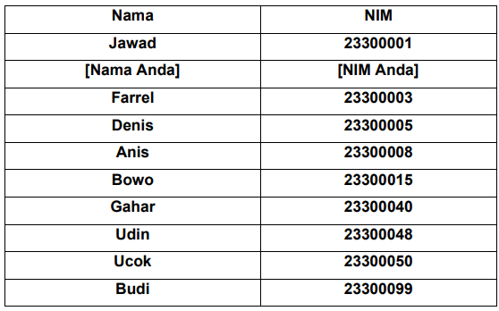

# <h1 align="center">Laporan Praktikum Modul Linked List Circular dan Non Circular</h1>
<p align="center">Azaria Nanda Putri - 2311102147</p>

## Dasar Teori
Linked list adalah kumpulan elemen yang terhubung melalui pointer. Setiap elemen memiliki pointer yang menyimpan alamat memori, bisa berupa data atau pointer lain. Elemen pertama disebut head, dan jika kosong, head menunjuk ke NULL. Elemen terakhir disebut tail dengan pointer yang menunjuk ke NULL. Linked list memungkinkan penyimpanan data dengan alokasi memori dinamis, dan mudah dalam penambahan serta penghapusan elemen, namun ia memiliki kelemahan dalam akses acak yang lambat dan kebutuhan ruang ekstra untuk pointer. Linked list sering digunakan untuk data yang sering mengalami perubahan dan membutuhkan fleksibilitas dalam operasi penambahan atau penghapusan. Selain itu, linked list juga sering digunakan dalam implementasi struktur data lain seperti stack, queue, dan graph.

- Ada dua jenis linked list: single linked list dan double linked list. Dalam single linked list, operasi umum meliputi penambahan dan penghapusan simpul di awal atau akhir, serta pencarian dan pengambilan nilai pada simpul tertentu. Karena hanya memerlukan satu pointer per simpul, single linked list lebih efisien dalam penggunaan memori dibandingkan double linked list dan circular linked list. Circular linked list memiliki penunjuk next pada node terakhir yang selalu merujuk ke node pertama. Sementara dalam double linked list, struktur data ini memiliki tambahan pointer prev pada setiap simpul, yang menunjuk ke simpul sebelumnya. Dengan fitur ini, operasi penghapusan dan penambahan pada simpul dapat dilakukan secara efisien. Namun, double linked list menggunakan lebih banyak memori dan memerlukan waktu eksekusi lebih lama dibandingkan single linked list dalam operasi penambahan dan penghapusan. 

### Terdapat beberapa jenis linked list, yaitu:
- Single linked list Non Circular <br/>
   Single linked list Non Circular adalah jenis struktur data linked list yang terdiri dari sejumlah node yang setiap node hanya memiliki satu pointer, yaitu pointer yang digunakan untuk menunjuk ke node selanjutnya dalam urutan linked list, kecuali untuk node terakhir yang disebut sebagai tail. Pada node tail atau node terakhir ini, pointer yang dimilikinya menunjuk ke NULL, menandakan akhir dari linked list tersebut.

- Double Linked List Non Circular <br/>
   Double Linked List Non Circular, saat berada pada node yang berfungsi sebagai head atau node pertama dalam linked list, nilai dari pointer prev pada node tersebut akan diatur menjadi NULL. Hal ini dikarenakan node head tidak memiliki node sebelumnya. Sedangkan untuk node yang berfungsi sebagai tail atau node terakhir dalam linked list, nilai dari pointer next pada node tersebut akan diatur untuk menunjuk ke NULL, menandakan akhir dari linked list tersebut.

- Single Circluar Linked List <br/>
   Double Linked List Non Circular, saat berada pada node yang berfungsi sebagai head atau node pertama dalam linked list, nilai dari pointer prev pada node tersebut akan diatur menjadi NULL. Hal ini dikarenakan node head tidak memiliki node sebelumnya. Sedangkan untuk node yang berfungsi sebagai tail atau node terakhir dalam linked list, nilai dari pointer next pada node tersebut akan diatur untuk menunjuk ke NULL, menandakan akhir dari linked list tersebut.

- Double Circluar Linked List <br/>
   Double Linked List Non Circular, saat berada pada node yang berfungsi sebagai head atau node pertama dalam linked list, nilai dari pointer prev pada node tersebut akan diatur menjadi NULL. Hal ini dikarenakan node head tidak memiliki node sebelumnya. Sedangkan untuk node yang berfungsi sebagai tail atau node terakhir dalam linked list, nilai dari pointer next pada node tersebut akan diatur untuk menunjuk ke NULL, menandakan akhir dari linked list tersebut.


    
## Guided 

### 1. Latihan Single Linked List Non Circular

```C++
#include <iostream>

using namespace std;

// PROGRAM SINGLE LINKED LIST NON-CIRCULAR

// Deklarasi struct node
struct Node
{
    int data;
    Node *next;
};

Node *head; // Deklarasi head
Node *tail; // Deklarasi tail

// Inisialisasi Node
void init()
{
    head = NULL;
    tail = NULL;
}

// Pengecekkan apakah linked list kosong
bool isEmpty()
{
    if (head == NULL)
    {
        return true;
    }
    else
    {
        return false;
    }
}
    // Tambah depan
    void insertDepan(int nilai)
    {

        // buat node baru
        Node *baru = new Node();
        baru->data = nilai;
        baru->next = NULL;
        if (isEmpty() == true)
        {
            head = tail = baru;
            head->next = NULL;
        }
        else
        {
            baru->next = head;
            head = baru;
        }
    }

    // Tambah belakang
    void insertBelakang(int nilai)
    {
        // buat node baru
        Node *baru = new Node();
        baru->data = nilai;
        baru->next = NULL;
        if (isEmpty() == true)
        {
            head = tail = baru;
            head->next = NULL;
        }
        else
        {
            tail->next = baru;
            tail = baru;
        }
    }

    // Hitung jumlah list
    int hitungList()
    {
        Node *hitung;
        hitung = head;
        int jumlah = 0;
        while (hitung != NULL)
        {
            jumlah++;
            hitung = hitung->next;
        }
        return jumlah;
    }

    // Tambah tengah
    void insertTengah(int data, int posisi)
    {
        if (posisi < 1 || posisi > hitungList())
        {
            cout << "Posisi di luar jangkauan" << endl;
        }
        else if (posisi == 1)
        {
            cout << "Posisi bukan posisi tengah" << endl;
        }
        else
        {
            Node *baru, *bantu;
            baru = new Node();
            baru->data = data;

            // tranversing
            bantu = head;
            int nomor = 1;
            while (nomor < posisi - 1)
            {
                bantu = bantu->next;
                nomor++;
            }

            baru->next = bantu->next;
            bantu->next = baru;
        }
    }

    // Hapus depan
    void hapusDepan()
    {
        Node *hapus;
        if (isEmpty() == false)
        {
            if (head->next != NULL)
            {
                hapus = head;
                head = head->next;
                delete hapus;
            }
            else
            {
                head = tail = NULL;
            }
        }
        else
        {
            cout << "Linked list masih kosong" << endl;
        }
    }

    // Hapus belakang
    void hapusBelakang()
    {
        Node *hapus;
        Node *bantu;
        if (isEmpty() == false)
        {
            if (head != tail)
            {
                hapus = tail;
                bantu = head;
                while (bantu->next != tail)
                {
                    bantu = bantu->next;
                }
                tail = bantu;
                tail->next = NULL;
                delete hapus;
            }
            else
            {
                head = tail = NULL;
            }
        }
        else
        {
            cout << "Linked list masih kosong" << endl;
        }
    }
    // Hapus tengah
    void hapusTengah(int posisi)
    {
        Node *hapus, *bantu, *sebelum;
        if (posisi < 1 || posisi > hitungList())
        {
            cout << "Posisi di luar jangkauan" << endl;
        }
        else if (posisi == 1)
        {
            cout << "Posisi bukan posisi tengah" << endl;
        }
        else
        {
            int nomor = 1;
            bantu = head;
            while (nomor <= posisi)
            {
                if (nomor == posisi - 1)
                {
                    sebelum = bantu;
                }
                if (nomor == posisi)
                {
                    hapus = bantu;
                }
                bantu = bantu->next;
                nomor++;
            }
            sebelum->next = bantu;
            delete hapus;
        }
    }

    // ubah depan
    void ubahDepan(int data)
    {
        if (isEmpty() == 0)
        {
            head->data = data;
        }
        else
        {
            cout << "Linked list masih kosong" << endl;
        }
    }

    // ubah tengah
    void ubahTengah(int data, int posisi)
    {
        Node *bantu;
        if (isEmpty() == 0)
        {
            if (posisi < 1 || posisi > hitungList())
            {
                cout << "Posisi di luar jangkauan" << endl;
            }
            else if (posisi == 1)
            {
                cout << "Posisi bukan posisi tengah" << endl;
            }
            else
            {
                int nomor = 1;
                bantu = head;
                while (nomor < posisi)
                {
                    bantu = bantu->next;
                    nomor++;
                }
                bantu->data = data;
            }
        }
        else
        {
            cout << "Linked list masih kosong" << endl;
        }
    }

    // ubah belakang
    void ubahBelakang(int data)
    {
        if (isEmpty() == 0)
        {
            tail->data = data;
        }
        else
        {
            cout << "Linked list masih kosong" << endl;
        }
    }

    // Hapus list
    void clearList()
    {
        Node *bantu, *hapus;
        bantu = head;
        while (bantu != NULL)
        {
            hapus = bantu;
            bantu = bantu->next;
            delete hapus;
        }
        head = tail = NULL;
        cout << "List berhasil terhapus!" << endl;
    }

    // Tampilkan list
    void tampilList()
    {
        Node *bantu;
        bantu = head;
        if (isEmpty() == false)
        {
            while (bantu != NULL)
            {
                cout << bantu->data << " ";
                bantu = bantu->next;
            }
            cout << endl;
        }
        else
        {
            cout << "Linked list masih kosong" << endl;
        }
    }

    int main()
    {
        init();
        insertDepan(3);
        tampilList();
        insertBelakang(5);
        tampilList();
        insertDepan(2);
        tampilList();
        insertDepan(1);
        tampilList();
        hapusDepan();
        tampilList();
        hapusBelakang();
        tampilList();
        insertTengah(7, 2);
        tampilList();
        hapusTengah(2);
        tampilList();
        ubahDepan(1);
        tampilList();
        ubahBelakang(8);
        tampilList();
        ubahTengah(11, 2);
        tampilList();

        return 0;
    }
```
Kode di atas digunakan uProgram di atas adalah program untuk mengelola data dalam bentuk single linked list non-circular menggunakan bahasa C++. Pertama-tama, kita mendefinisikan struct Node yang berisi data dan pointer next. Lalu, kita mulai dengan head dan tail yang diinisialisasi sebagai NULL. Selanjutnya, kita buat beberapa fungsi untuk menambahkan data di awal, akhir, dan di tengah list. Selain itu, ada fungsi untuk menghitung panjang list, menghapus data di berbagai posisi, mengubah data di berbagai posisi, menghapus semua data, dan menampilkan data.

### 2. Latihan Single Linked List Circular
```c++
#include <iostream>

using namespace std;

// Deklarasi Struct Node


struct Node
{
    string data;
    Node* next;
};

Node* head, * tail, * baru, * bantu, * hapus;

//Inisialisasi node head & tail
void init(){
    head = NULL;
    tail = head;
}

//Pengecekan isi list
int isEmpty(){
    if (head == NULL){
        return 1; // true
    } else {
        return 0; // false
    }
}

//Buat Node Baru
void buatNode(string data){
    baru = new Node;
    baru->data = data;
    baru->next = NULL;
}

//Hitung List
int hitungList(){
    bantu = head;
    int jumlah = 0;
    while (bantu != NULL) {
        jumlah++;
        bantu = bantu->next;
    }
    return jumlah;
}

//Tambah Depan
void insertDepan(string data){
    // Buat Node baru
    buatNode(data);

    if (isEmpty() == 1){
        head = baru;
        tail = head;
        baru->next = head;
    } else {
        while (tail->next != head){
            tail = tail->next;
        }
        baru->next = head;
        head = baru;
        tail->next = head;
    }
}

//Tambah Belakang
void insertBelakang(string data){
    // Buat Node baru
    buatNode(data);

    if (isEmpty() == 1){
        head = baru;
        tail = head;
        baru->next = head;
    } else {
        while (tail->next != head){
            tail = tail->next;
        }
        tail->next = baru;
        baru->next = head;
    }
}

//Tambah Tengah
void insertTengah(string data, int posisi){
    if (isEmpty() == 1){
        head = baru;
        tail = head;
        baru->next = head;
    } else {
        baru->data = data;
        // transversing
        int nomor = 1;
        bantu = head;
        while (nomor < posisi - 1){
            bantu = bantu->next;
            nomor++;
        }
        baru->next = bantu->next;
        bantu->next = baru;
    }
}

//Hapus Depan
void hapusDepan(){
    if (isEmpty() == 0){
        hapus = head;
        tail = head;
        if (hapus->next == head){
            head = NULL;
            tail = NULL;
            delete hapus;
        } else {
            while (tail->next != hapus){
                tail = tail->next;
            }
            head = head->next;
            tail->next = head;
            hapus->next = NULL;
            delete hapus;
        }
    } else {
        cout << "List masih kosong!" << endl;
    }
}

//Hapus Belakang
void hapusBelakang(){
    if (isEmpty() == 0){
        hapus = head;
        tail = head;
        if (hapus->next == head){
            head = NULL;
            tail = NULL;
            delete hapus;
        } else {
            while (hapus->next != head){
                hapus = hapus->next;
            }
            while (tail->next != hapus){
                tail = tail->next;
            }
            tail->next = head;
            hapus->next = NULL;
            delete hapus;
        }
    } else {
        cout << "List masih kosong!" << endl;
    }
}

// Hapus Tengah
void hapusTengah(int posisi){
    if (isEmpty() == 0){
        // transversing
        int nomor = 1;
        bantu = head;
        while (nomor < posisi - 1){
            bantu = bantu->next;
            nomor++;
        }
        hapus = bantu->next;
        bantu->next = hapus->next;
        delete hapus;
    } else {
        cout << "List masih kosong!" << endl;
    }
}

//Hapus List
void clearList(){
    if (head != NULL){
        hapus = head->next;
        while (hapus != head){
            bantu = hapus->next;
            delete hapus;
            hapus = bantu;
        }
        delete head;
        head = NULL;
    }
    cout << "List berhasil terhapus!" << endl;
}

//Tampilkan List
void tampil(){
    if (isEmpty() == 0){
        tail = head;
        do {
            cout << tail->data << ends;
            tail = tail->next;
        } while (tail != head);
        cout << endl;
    } else {
        cout << "List masih kosong!" << endl;
    }
}

int main(){
    init();
    insertDepan("Ayam");
    tampil();
    insertDepan("Bebek");
    tampil();
    insertBelakang("Cicak");
    tampil();
    insertBelakang("Domba");
    tampil();
    hapusBelakang();
    tampil();
    hapusDepan();
    tampil();
    insertTengah("Sapi", 2);
    tampil();
    hapusTengah(2);
    tampil();
    
    return 0;
}
```
Kode tersebut adalah sebuah program yang menggunakan single linked list circular. Dalam program ini, kita memiliki sebuah struktur (struct) yang dinamakan Node yang berisi informasi data dalam bentuk string dan pointer yang menunjuk ke node berikutnya. Kemudian, mendeklarasikan struktur Node dengan informasi string data dan pointer next. Dan mendeklarasikan beberapa variabel seperti head, tail, baru, bantu, dan hapus yang semuanya bertipe pointer Node. selanjutnya, kita membuat beberapa fungsi untuk menambahkan data ke dalam list, baik di bagian depan, belakang, maupun di tengah list. Selain itu, ada juga fungsi untuk menghapus data dari list, menghitung jumlah data, menampilkan seluruh data, dan menghapus semua data dalam list.  Kemudian kita panggil fungsi-fungsi tersebut di dalam fungsi main. Tampilan output program di atas adalah: <br/>
Ayam <br/>
Bebek Ayam <br/>
Bebek Ayam Cicak <br/>
Bebek Ayam Cicak Domba <br/>
Bebek Ayam Cicak <br/>
Ayam Cicak <br/>
Ayam Sapi Cicak <br/>
Ayam Cicak <br/>

## Unguided 

Buatlah program menu Linked List Non Circular untuk menyimpan Nama dan NIM mahasiswa, dengan menggunakan input dari user. Setelah membuat menu tersebut, masukkan data sesuai urutan berikut, lalu tampilkan data yang telah dimasukkan. <br/>

1. Masukkan data sesuai urutan berikut. (Gunakan insert depan, belakang atau tengah). Data kedua yang dimasukkan adalah nama dan NIM anda.<br/>
<br/>
2. Tambahkan data berikut diantara Farrel dan Denis: Wati 2330004 <br/>
3. Hapus data Denis <br/>
4. Tambahkan data berikut di awal: Owi 2330000<br/>
5. Tambahkan data berikut di akhir: David 23300100<br/>
6. Ubah data Udin menjadi data berikut: Idin 23300045<br/>
7. Ubah data terkahir menjadi berikut: Lucy 23300101<br/>
8. Hapus data awal<br/>
9. Ubah data awal menjadi berikut: Bagas 2330002<br/>
10. Hapus data akhir <br/>
11. Tampilkan seluruh data <br/>

```C++
#include <iostream>
#include <iomanip>

using namespace std;

// Deklarasi struct node
struct Node
{
    string Nama_147;
    long long int NIM_147;
    Node *next;
};

Node *head = nullptr; // Deklarasi head
Node *tail = nullptr; // Deklarasi tail

// Inisialisasi Node
void Inisialisasi_147()
{
    head = nullptr;
    tail = nullptr;
}

// Pengecekkan apakah linked list kosong
bool isEmpty_147()
{
    return head == nullptr;
}

// Tambah depan
void InsertDepan_147(string nama_147, long long int nim_147)
{
    Node *baru = new Node();
    baru->Nama_147 = nama_147;
    baru->NIM_147 = nim_147;
    baru->next = nullptr;

    if (isEmpty_147())
    {
        head = tail = baru;
    }
    else
    {
        baru->next = head;
        head = baru;
    }
}

// Tambah belakang
void insertBelakang_147(string nama_147, long long int nim_147)
{
    Node *baru = new Node();
    baru->Nama_147 = nama_147;
    baru->NIM_147 = nim_147;
    baru->next = nullptr;

    if (isEmpty_147())
    {
        head = tail = baru;
    }
    else
    {
        tail->next = baru;
        tail = baru;
    }
}

// Hitung jumlah list
int hitungList_147()
{
    Node *hitung = head;
    int jumlah = 0;
    while (hitung != nullptr)
    {
        jumlah++;
        hitung = hitung->next;
    }
    return jumlah;
}

// Tambah tengah
void insertTengah_147(string nama_147, long long int nim_147, int posisi)
{
    if (posisi < 1 || posisi > hitungList_147())
    {
        cout << "Posisi di luar jangkauan" << endl;
        return;
    }
    else if (posisi == 1)
    {
        cout << "Posisi bukan posisi tengah" << endl;
        return;
    }
    else
    {
        Node *baru = new Node();
        baru->Nama_147 = nama_147;
        baru->NIM_147 = nim_147;

        Node *bantu = head;
        for (int i = 1; i < posisi - 1; i++)
        {
            bantu = bantu->next;
        }

        baru->next = bantu->next;
        bantu->next = baru;
    }
}

// Hapus depan
void hapusDepan_147()
{
    if (!isEmpty_147())
    {
        Node *hapus = head;
        if (head->next != nullptr)
        {
            head = head->next;
        }
        else
        {
            head = tail = nullptr;
        }
        delete hapus;
    }
    else
    {
        cout << "Linked list masih kosong" << endl;
    }
}

// Hapus belakang
void hapusBelakang_147()
{
    if (!isEmpty_147())
    {
        Node *hapus = tail;
        if (head != tail)
        {
            Node *bantu = head;
            while (bantu->next != tail)
            {
                bantu = bantu->next;
            }
            tail = bantu;
            tail->next = nullptr;
        }
        else
        {
            head = tail = nullptr;
        }
        delete hapus;
    }
    else
    {
        cout << "Linked list masih kosong" << endl;
    }
}

// Hapus tengah
void hapusTengah_147(int posisi)
{
    if (posisi < 1 || posisi > hitungList_147())
    {
        cout << "Posisi di luar jangkauan" << endl;
        return;
    }
    else if (posisi == 1)
    {
        cout << "Posisi bukan posisi tengah" << endl;
        return;
    }
    else
    {
        Node *hapus, *bantu;
        bantu = head;
        for (int i = 1; i < posisi - 1; i++)
        {
            bantu = bantu->next;
        }
        hapus = bantu->next;
        bantu->next = hapus->next;
        delete hapus;
    }
}

// Ubah depan
void ubahDepan_147(string nama_147, long long int nim_147)
{
    if (!isEmpty_147())
    {
        head->Nama_147 = nama_147;
        head->NIM_147 = nim_147;
    }
    else
    {
        cout << "Linked list masih kosong" << endl;
    }
}

// Ubah tengah
void ubahTengah_147(string nama_147, long long int nim_147, int posisi)
{
    if (!isEmpty_147())
    {
        if (posisi < 1 || posisi > hitungList_147())
        {
            cout << "Posisi di luar jangkauan" << endl;
            return;
        }
        else if (posisi == 1)
        {
            cout << "Posisi bukan posisi tengah" << endl;
            return;
        }
        else
        {
            Node *bantu = head;
            for (int i = 1; i < posisi; i++)
            {
                bantu = bantu->next;
            }
            bantu->Nama_147 = nama_147;
            bantu->NIM_147 = nim_147;
        }
    }
    else
    {
        cout << "Linked list masih kosong" << endl;
    }
}

// Ubah belakang
void ubahBelakang_147(string nama_147, long long int nim_147)
{
    if (!isEmpty_147())
    {
        tail->Nama_147 = nama_147;
        tail->NIM_147 = nim_147;
    }
    else
    {
        cout << "Linked list masih kosong" << endl;
    }
}

// Hapus list
void clearList_147()
{
    Node *bantu = head;
    while (bantu != nullptr)
    {
        Node *hapus = bantu;
        bantu = bantu->next;
        delete hapus;
    }
    head = tail = nullptr;
    cout << "List berhasil terhapus!" << endl;
}

// Tampilkan list
void tampilList_147()
{
    if (!isEmpty_147())
    {
        cout << "------------ 2147 TAMPILKAN 2147 ---------------" << endl;
        cout << "----------------------------------------" << endl;
        cout << left << setw(20) << "| Nama" << "| NIM" << endl;
        cout << "----------------------------------------" << endl;
        Node *bantu = head;
        while (bantu != nullptr)
        {
            cout << left << setw(20) << "| " + bantu->Nama_147 << "| " << bantu->NIM_147 << endl;
            bantu = bantu->next;
        }

        cout << "----------------------------------------" << endl;
    }
    else
    {
        cout << "------------ 2147 TAMPILKAN 2147 ---------------" << endl;
        cout << "----------------------------------------" << endl;
        cout << left << setw(20) << "| Nama" << "| NIM" << endl;
        cout << "----------------------------------------" << endl;
        cout << left << setw(20) << "| (NULL)" << "| (NULL) " << endl;
        cout << "----------------------------------------" << endl;
    }
}

int main()
{
    string nama_147;
    long long int nim_147;
    int posisi;

    Inisialisasi_147();

    cout << "========== PROGRAM SINGLE LINKED LIST NON-CIRCULAR ==========" << endl;

    while (true)
    {
        cout << "|-------------------------|" << endl; 
        cout << "|1. menambah data di depan|" << endl; 
        cout << "|-------------------------|" << endl;       
        cout << "|2. menambah data di Belakang|" << endl;
        cout << "|-------------------------|" << endl;       
        cout << "|3. menambah data di Tengah|" << endl;
        cout << "|-------------------------|" << endl;       
        cout << "|5. mengubah data di belakang|" << endl;
        cout << "|-------------------------|" << endl;       
        cout << "|6. mengubah data di Tengah|" << endl;
        cout << "|-------------------------|" << endl;       
        cout << "|7. menghapus data di depan|" << endl;
        cout << "|-------------------------|" << endl;       
        cout << "|8. menghapus data di belakang|" << endl;
        cout << "|-------------------------|" << endl;       
        cout << "|9. menghapus data di tengah|" << endl;
        cout << "|-------------------------|" << endl;       
        cout << "|10.Hapus List|" << endl;
        cout << "|-------------------------|" << endl;       
        cout << "|11. Menampilkan Data|" << endl;
        cout << "|-------------------------|" << endl;       
        cout << "|0. Keluar|" << endl;
        cout << "------------------------------------------" << endl;
        int pilihan;
        cout << "Masukkan pilihan: ";
        cin >> pilihan;

        switch (pilihan)
        {
        case 1:
            cout << "Masukkan Nama: ";
            cin >> nama_147;   
            cout << "Masukkan NIM: ";
            cin >> nim_147;
            InsertDepan_147(nama_147, nim_147);     
            cout << "Data [" << nama_147 << "] berhasil ditambahkan di depan! " << endl;
            break;

        case 2:
            cout << "Masukkan Nama: ";  
            cin >> nama_147;
            cout << "Masukkan NIM: ";
            cin >> nim_147;       
            insertBelakang_147(nama_147, nim_147);
            cout << "Data [" << nama_147 << "] berhasil ditambahkan di belakang! " << endl;
            break;

        case 3:
            cout << "Masukkan posisi: ";
            cin >> posisi;
            cout << "Masukkan nama: ";
            cin >> nama_147;
            cout << "Masukkan NIM: ";
            cin >> nim_147;
            insertTengah_147(nama_147, nim_147, posisi);
            cout << "Data [" << nama_147 << "] berhasil ditambahkan di posisi ke-" << posisi << "!" << endl;
            break;

        case 4:
            cout << "Masukkan nama: ";
            cin >> nama_147;
            cout << "Masukkan NIM: ";
            cin >> nim_147;
            ubahDepan_147(nama_147, nim_147);
            cout << "Data depan berhasil diubah!" << endl;
            break;

        case 5:
            cout << "Masukkan nama: ";
            cin >> nama_147;
            cout << "Masukkan NIM: ";
            cin >> nim_147;
            ubahBelakang_147(nama_147, nim_147);
            cout << "Data belakang berhasil diubah!" << endl;
            break;

        case 6:
            cout << "Masukkan posisi: ";
            cin >> posisi;
            cout << "Masukkan nama: ";
            cin >> nama_147;
            cout << "Masukkan NIM: ";
            cin >> nim_147;
            ubahTengah_147(nama_147, nim_147, posisi);
            cout << "Data di posisi ke-" << posisi << " berhasil diubah!" << endl;
            break;

        case 7:
            hapusDepan_147();
            cout << "Data depan berhasil dihapus!" << endl;
            break;

        case 8:
            hapusBelakang_147();
            cout << "Data belakang berhasil dihapus!" << endl;
            break;

        case 9:
            cout << "Masukkan posisi: ";
            cin >> posisi;
            hapusTengah_147(posisi);
            cout << "Data di posisi ke-" << posisi << " berhasil dihapus!" << endl;
            break;

        case 10:
            clearList_147();
            cout << "Semua data berhasil dihapus!" << endl;
            break;

        case 11:
            tampilList_147();
            break;

        case 0:
            cout << "Program selesai!" << endl;
            return 0;

        default:
            cout << "Pilihan tidak tersedia!" << endl;
            break;
        }
    }

    return 0;
}
```
#### Output:
.png)
.png)
.png)
.png)
.png)
.png)
.png)

Kode di atas adalah implementasi program dengan menggunakan single linked list non-circular. Program ini memungkinkan pengguna untuk melakukan operasi seperti menambah, mengubah, dan menghapus data dalam linked list serta melihat seluruh data yang ada. Struct Node digunakan untuk menyimpan informasi data dengan atribut Nama_147 dan NIM_147, serta pointer next untuk menunjuk ke node berikutnya. Program memiliki berbagai fungsi dasar seperti Inisialisasi_147() untuk inisialisasi, isEmpty_147() untuk memeriksa kekosongan linked list, dan fungsi lainnya untuk operasi tambah, hapus, ubah, dan tampil data. Di dalam fungsi main(), program menyediakan menu pilihan operasi untuk pengguna. Setelah memilih, program akan menjalankan fungsi yang sesuai dengan pilihan pengguna dan memberikan informasi hasil operasi melalui pesan pada layar.

Di dalam main program terdapat beberapa pilihan menu yang bisa dipilih oleh user, yaitu:
1. Tambah Depan
2. Tambah Belakang
3. Tambah Tengah
4. Ubah Depan
5. Ubah Belakang
6. Ubah Tengah
7. Hapus Depan
8. Hapus Belakang
9. Hapus Tengah
10. Hapus List
11. Tampilkan
0. Keluar<br/>

User dapat memilih menu yang diinginkan dengan memasukkan angka yang sesuai dengan menu yang diinginkan. User dapat memilih 0 apabila ingin keluar dari program,


## Kesimpulan
Linked list adalah kumpulan elemen yang saling terhubung melalui pointer, di mana setiap elemen terhubung dengan elemen lainnya melalui sebuah pointer. Pointer adalah variabel yang menyimpan alamat memori dari variabel lain, yang bisa berupa data atau pointer lainnya. Oleh karena itu, setiap elemen dalam linked list selalu mengandung pointer. Secara umum, linked list terdiri dari beberapa elemen, di mana salah satu elemen pertama memiliki karakteristik khusus dan tidak digunakan untuk menyimpan data. Elemen ini dikenal dengan sebutan elemen kepala atau Head. Berikut adalah contoh sederhana dari linked list dengan satu elemen kepala dan beberapa elemen lainnya.

linked list terbagi menjadi dua: single linked list dan double linked list. Dalam single linked list, operasi umum meliputi penambahan dan penghapusan simpul di awal atau akhir, serta pencarian dan pengambilan nilai pada simpul tertentu. Karena hanya memerlukan satu pointer per simpul, single linked list lebih efisien dalam penggunaan memori dibandingkan double linked list dan circular linked list. Circular linked list memiliki penunjuk next pada node terakhir yang selalu merujuk ke node pertama. Sementara dalam double linked list, struktur data ini memiliki tambahan pointer prev pada setiap simpul, yang menunjuk ke simpul sebelumnya. Dengan fitur ini, operasi penghapusan dan penambahan pada simpul dapat dilakukan secara efisien. Namun, double linked list menggunakan lebih banyak memori dan memerlukan waktu eksekusi lebih lama dibandingkan single linked list dalam operasi penambahan dan penghapusan. 


## Referensi
[1] Indrajani Martin., Pemrograman Objek Dengan C++. Jakarta: Elex media, 2019.<br/>
[2] Dr. Joseph Teguh Santoso., Struktur Data dan ALgoritma. Semarang: Yayasan Prima Agus Teknik, 2021.

